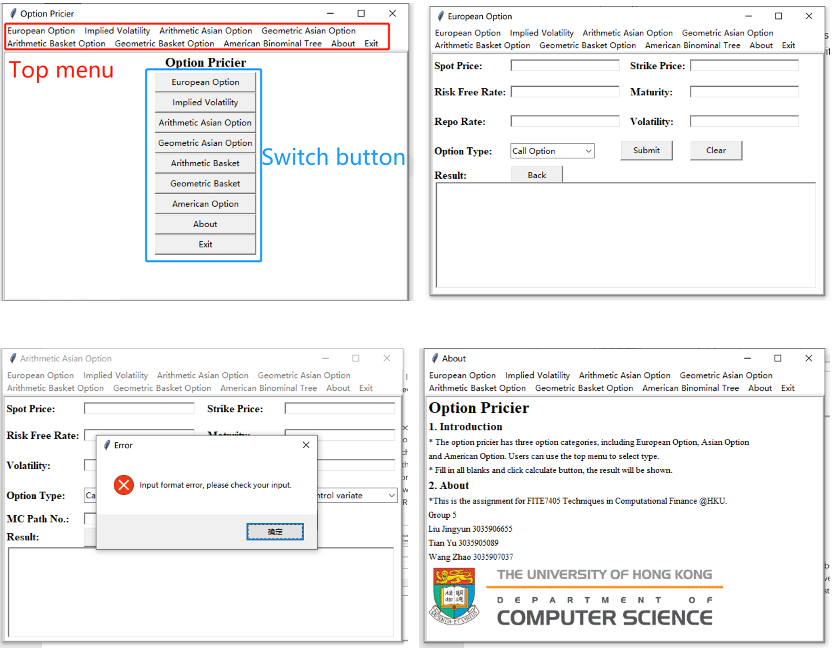

## I. Team Members

Group 5

LIU Jingyun 3035906055: Most of the algorithm design 

TIAN Yu 3035905089: GUI Implementation 

WANG Zhao 3035907037: Supporting works 

## II. Option Pricer User Interface

The user interface is developed based on tkinker, which is a native python UI library that provides powerful functions and components. In the user interfaces, we provide seven frames that contains different option types.

First, when running the GUI.py program, a start page will be shown. Users can choose use the button or top menus (for Windows OS) select an option type. After switching to an option type, users could see the interface which is similar as the figure x. Through such interface, users can input the parameters of the option to calculate the result. If finish, click the “submit” button to get the result. The validity of values in each blank will be checked automatically. If some of the fields have a wrong input, an error message will be throwed as shown in figure x. If everything is ok, the result will be inserted into the bottom field named “Result”. The “Clear” button is set to clear all inputs in each blank. 



If users want to switch the function, either use the top menu or click the “Back” button. And the window will go back to the start page or go to the specific page. Moreover, we also provide a specification of the program and the project group. If users are interested, just go to the “About” page and all information will be listed as shown in the figure x.

## III. The functionalities of each class/function

### 1. geometric_asian_basket.py

In this script, there are 2 functions (`geometric_asian_option` and `geometric_basket_option`) for **geometric option pricing  with closed-form formula**.

**a) geometric_asian_option**

```python
def geometric_asian_option(S:float, sigma:float, r:float, T:float, K:float, n:int, option_type:str) -> float
```


The function is used to compute the price of a **geometric asian option** with the **closed-form formula**

:param S: The spot price at time = 0, S(0)
:param sigma: The true volatility
:param r: The risk-free rate
:param T: The time to maturity (in years)
:param K: The strike price
:param n: The number of observation times for the geometric average
:param option_type: A character indicating the option type, 'C' for call option, 'T' for put option

:return: The value of the call/put Geometric Asian Option

**b) geometric_basket_option**

```python
def geometric_basket_option(S1:float, S2:float, sigma1:float, sigma2:float, rho:float, r:float, T:float, K:float, option_type:str) -> float
```

The function is used to compute the price of a **geometric basket option (of 2 assets)** with the **closed-form formula**

:param S1: The spot price of asset 1 at time = 0, S1(0)
:param S2: The spot price of asset 2 at time = 0, S2(0)
:param sigma1: The true volatility of asset 1
:param sigma2: The true volatility of asset 2
:param rho: The correlation coefficient of the two assets
:param r: The risk-free rate
:param T: The time to maturity (in years)
:param K: The strike price
:param option_type: A character indicating the option type, 'C' for call option, 'T' for put option

:return: The value of the call/put Geometric Basket Option

### 2. arithmetic_asian_mc.py
In this script, there is 1 function (`arithmatic_asian_option`) for **asian option pricing  with Monte Carlo Simulation**. The random seed for MC simulation is set to be 42, and the confidence level is set to be 95%.

By changing the argument `control_method`, you can apply Monte Carlo Simulation on **different Asian options (geometric/ arithmetic)**, and the arithmetic Asian option pricing is further divided as **Standard MC (without a control variate)** and **MC with geometric option as the control variate**.

**a) arithmatic_asian_option**

```python
def arithmatic_asian_option(S:float, sigma:float, r:float, T:float, K:float, n:int, option_type:str, m:int, control_method='arith', CI=0.95) -> tuple(float, float, float)
```

The function is used to compute the price of an arithmatic asian option with Monte Carlo Simulation

:param S: The spot price at time = 0, S(0)
:param sigma: The true volatility
:param r: The risk-free rate
:param T: The time to maturity (in years)
:param K: The strike price
:param n: The number of observation times for the average spot price
:param m:  The number of paths in the Monte Carlo simulation
:param option_type: A character indicating the option type, 'C' for call option, 'T' for put option:param control_method: The control variate method 

​											(**Default:'arith' for arithmetic asian option with standard MC**,
​											**'geo' for geometric asian option with standard MC**,
​											 **'control' for arithmetic asian MC with control variate**)

:param CI: The confidence level (1 - alpha), presented in float format, by default, CI=0.95


:return:  The expected value of the confidence interval, the **lower boundary of the confidence interval**, and the **upper boundary of the confidence interval** with a 95% confidence level. (A tuple of 3 floats)


### 3. arithmetic_basket_mc.py
In this script, there is 1 function (`arithmatic_basket_option`) for a **basket option of 2 assets with Monte Carlo Simulation**. The random seed for MC simulation is set to be 42, and the confidence level is set to be 95%.

By changing the argument `control_method`, you can apply Monte Carlo Simulation on **different basket options (geometric/ arithmetic)**, and the arithmetic basket option pricing is further divided as **Standard MC (without a control variate)** and **MC with geometric option as the control variate**.

**a) arithmatic_basket_option**

```python
def arithmatic_basket_option(S1:float, S2:float, sigma1:float, sigma2:float, rho:float, r:float, T:float, K:float, option_type:str, m:int, control_method='arith', CI=0.95) -> tuple(float, float, float)
```


The function is used to compute the price of an arithmatic basket option (of 2 assets) with Monte Carlo Simulation.


:param S1: The spot price of asset 1 at time = 0, S1(0)
:param S2: The spot price of asset 2 at time = 0, S2(0)
:param sigma1: The true volatility of asset 1
:param sigma2: The true volatility of asset 2
:param rho: The correlation coefficient of the two assets
:param r: The risk-free rate
:param T: The time to maturity (in years)
:param K: The strike price
param option_type: A character indicating the option type, 'C' for call option, 'T' for put option
:param m:  The number of paths in the Monte Carlo simulation
:param control_method: The control variate method 

​											(**Default:'arith' for arithmetic asian option with standard MC**,
​											**'geo' for geometric asian option with standard MC**,
​											 **'control' for arithmetic asian MC with control variate**)
:param CI: The confidence level (1 - alpha), presented in float format, by default, CI=0.95


:return: The expected value of the confidence interval, the **lower boundary of the confidence interval**, and the **upper boundary of the confidence interval** with a 95% confidence level. (A tuple of 3 floats)


### 4.  binomial_tree_american.py

In this script, there is one function ` binomial_tree_american_optio` for **american option pricing with binomial tree method**.

**a) binomial_tree_american_option**

```python
def binomial_tree_american_option(S:float, sigma:float, r:float, T:float, K:float, N:int, option_type:str) -> float
```


The function is used to compute the price of an american option with a binomial tree

:param S: The spot price at time = 0, S(0)
:param sigma: The true volatility
:param r: The risk-free rate
:param T: The time to maturity (in years)
:param K: The strike price
:param N: The number of steps
:param option_type: A character indicating the option type, 'C' for call option, 'T' for put option

:return: The value of the call/put American Option with N steps


## IV. Test cases and analysis

### 1. Asian Options

| $\sigma$ | K    | n    | Type | Geometric <br />(Closed-Form Formula) | Geometric <br />(Standard MC)               | Arithmetic <br />(Standard MC)              |    Arithmetic<br /> (w/ Control Variate)    |
| -------- | ---- | ---- | ---- | ------------------------------------- | ------------------------------------------- | ------------------------------------------- | :-----------------------------------------: |
| 0.3      | 100  | 50   | Put  | 8.482704545                           | 8.455503922<br />[8.382504455, 8.528503389] | 7.774850425<br />[7.706082131, 7.84361872]  | 7.800471016<br />[7.79517499, 7.805767042]  |
| 0.3      | 100  | 100  | Put  | 8.431080156                           | 8.409039991<br />[8.336468696, 8.481611286] | 7.730932805<br />[7.662592071, 7.799273539] | 7.751685577<br />[7.74641376, 7.756957394]  |
| 0.4      | 100  | 50   | Put  | 12.55876944                           | 12.53042902<br />[12.43401463, 12.62684341] | 11.25402483<br />[11.16447102, 11.34357864] | 11.28033504<br />[11.27125006, 11.28942002] |
| 0.3      | 100  | 50   | Call | 13.25912613                           | 13.17963577<br />[13.05057707, 13.30869448] | 14.64557312<br />[14.50218075, 14.78896549] | 14.73400523<br />[14.71855835, 14.74945211] |
| 0.3      | 100  | 100  | Call | 13.13877911                           | 13.06080964<br />[12.93308903, 13.18853024] | 14.517838<br />[14.37591534, 14.65976066]   | 14.60459593<br />[14.58950834, 14.61968352] |
| 0.4      | 100  | 50   | Call | 15.75981978                           | 15.6487623<br />[15.47527128, 15.82225333   | 18.09016399<br />[17.88867362, 18.29165437] | 18.21950503<br />[18.18915937, 18.24985069] |

Based on the test result on the Asian options:

- Asian put option:
  1. **volatility**: The higher the volatility, the higher the option price
  2. **the number of observation times**: The larger the observation times, the lower the option price
  3. **strike price**: The higher the strike price, the higher the option price
- Asian call option:
  1. **volatility**: The higher the volatility, the higher the option price
  2. **the number of observation times**: The larger the observation times, the lower the option price
  3. **strike price**: The higher the strike price, the lower the option price

### 2. Basket Options

| $S_1(0)$ | $S_2(0)$ | K    | $\sigma_1$ | $\sigma_2$ | $\rho$ | Type | Geometric <br />(Closed-Form Formula) | Geometric <br />(Standard MC)               | Arithmetic <br />(Standard MC)              | Arithmetic<br /> (w/ Control Variate)       |
| -------- | -------- | ---- | ---------- | ---------- | ------ | ---- | ------------------------------------- | ------------------------------------------- | ------------------------------------------- | ------------------------------------------- |
| 100      | 100      | 100  | 0.3        | 0.3        | 0.5    | Put  | 11.49157267                           | 11.46423977<br />[11.36691461, 11.56156494] | 10.54155956<br />[10.44735344, 10.63576569] | 10.56791278<br />[10.55552822, 10.58029735] |
| 100      | 100      | 100  | 0.3        | 0.3        | 0.9    | Put  | 12.62235016                           | 12.56750855<br />[12.46183776, 12.67317935] | 12.37475464<br />[12.26972137, 12.47978791] | 12.42925738<br />[12.42651513, 12.43199964] |
| 100      | 100      | 100  | 0.1        | 0.3        | 0.5    | Put  | 6.58638062                            | 6.579235745<br />[6.512981322, 6.645490167] | 5.507727432<br />[5.450672984, 5.56478188]  | 5.513879831<br />[5.503352838, 5.524406823] |
| 100      | 100      | 80   | 0.3        | 0.3        | 0.5    | Put  | 4.711576629                           | 4.697413575<br />[4.639548758, 4.755278393] | 4.232219809<br />[4.177109485, 4.287330134] | 4.245649347<br />[4.237632022, 4.253666672] |
| 100      | 100      | 120  | 0.3        | 0.3        | 0.5    | Put  | 21.28910516                           | 21.26771707<br />[21.13174527, 21.40368887] | 19.85411561<br />[19.72071306, 19.98751815] | 19.87502316<br />[19.85861833, 19.89142799] |
| 100      | 100      | 100  | 0.5        | 0.5        | 0.5    | Put  | 23.46914802                           | 23.44792479<br />[23.29808295, 23.59776663] | 21.04530575<br />[20.8993109, 21.1913006]   | 21.06579333<br />[21.03741367, 21.09417299] |
| 100      | 100      | 100  | 0.3        | 0.3        | 0.5    | Call | 22.1020928                            | 22.25587192<br />[22.02668126, 22.48506258] | 24.63294102<br />[24.38941247, 24.87646958] | 24.47003811<br />[24.43763474, 24.50244148] |
| 100      | 100      | 100  | 0.3        | 0.3        | 0.9    | Call | 25.87882553                           | 26.11994938<br />[25.84496704, 26.39493172] | 26.59833613<br />[26.32041699, 26.87625526] | 26.3546598<br />[26.34795518, 26.36136441]  |
| 100      | 100      | 100  | 0.1        | 0.3        | 0.5    | Call | 17.92473661                           | 17.96842049<br />[17.81321121, 18.12362977] | 19.48270725<br />[19.30868707, 19.65672742] | 19.43371632<br />[19.40990716, 19.45752547] |
| 100      | 100      | 80   | 0.3        | 0.3        | 0.5    | Call | 32.53625629                           | 32.70320525<br />[32.44542166, 32.96098884] | 35.5377608<br />[35.26658075, 35.80894085]  | 35.36262227<br />[35.32945791, 35.39578664] |
| 100      | 100      | 120  | 0.3        | 0.3        | 0.5    | Call | 14.68546576                           | 14.84518969<br />[14.64806495, 15.04231442] | 16.73133754<br />[16.51964592, 16.94302916] | 16.56039776<br />[16.52946755, 16.59132797] |
| 100      | 100      | 100  | 0.5        | 0.5        | 0.5    | Call | 28.44938652                           | 28.78775144<br />[28.37314623, 29.20235665] | 35.26803197<br />[34.79132665, 35.74473729] | 34.88176073<br />[34.76707903, 34.99644244] |

Based on the test result on the Basket options:

- Basket put option:

  1. **strike price**: The higher the strike price, the higher the option price
  2. **volatility**: The higher the volatility, the higher the option price
  3. **correlation coefficient**: The higher the correlation between the 2 options, the higher the option price

- Basket call option:

  1. **strike price**: The higher the strike price, the lower the option price

  2. **volatility**: The higher the volatility, the higher the option price

  3. **correlation coefficient**: The higher the correlation between the 2 options, the higher the option price


### 3. American Options with Binomial Tree Method


| S  | Sigma | rate | T |  K | option | Steps | Price              |
|----|-------|------|---|:--:|--------|-------|--------------------|
| 50 | 0.4   | 0.1  | 2 | 40 | Put    | 200   | 3.408860068804277  |
| 50 | 0.4   | 0.1  | 2 | 50 | Put    | 200   | 7.462232529892283  |
| 50 | 0.4   | 0.1  | 2 | 70 | Put    | 200   | 20.819388650478025 |
| 50 | 0.6   | 0.1  | 2 | 40 | Put    | 200   | 7.3353969572779665 |
| 50 | 0.2   | 0.1  | 2 | 40 | Put    | 200   | 0.4494103487801777 |
| 50 | 0.4   | 0.2  | 2 | 40 | Put    | 200   | 2.0856329998958905 |
| 50 | 0.4   | 0.05 | 2 | 40 | Put    | 200   | 4.395966795611523  |
| 50 | 0.4   | 0.1  | 1 | 40 | Put    | 200   | 2.154748854855614  |
| 50 | 0.4   | 0.1  | 3 | 40 | Put    | 200   | 4.196047751715404  |
| 50 | 0.4   | 0.1  | 2 | 40 | Put    | 20    | 3.419029277204208  |
| 50 | 0.4   | 0.1  | 2 | 50 | Call   | 200   | 15.133147860236729 |
| 50 | 0.4   | 0.1  | 2 | 60 | Call   | 200   | 11.527123710455813 |
| 50 | 0.6   | 0.1  | 2 | 60 | Call   | 200   | 16.88935381082192  |
| 50 | 0.2   | 0.1  | 2 | 60 | Call   | 200   | 6.024781548497462  |
| 50 | 0.4   | 0.05 | 2 | 60 | Call   | 200   | 9.656518301976204 |
| 50 | 0.4   | 0.2  | 2 | 60 | Call   | 200   | 15.630992033670275 |
| 50 | 0.4   | 0.1  | 1 | 60 | Call   | 200   | 6.185633680851854 |
| 50 | 0.4   | 0.1  | 3 | 60 | Call   | 200   | 15.839715396916297 |

Based on the test result on the Ameraica options:

-  Put option:

  1. **strike price**: The higher the strike price, the higher the option price
  2. **volatility**: The higher the volatility, the higher the option price
  3. **risk-free interest**: The higher the risk-free interest, the lower the option price
  4. **maturity**: The longer the maturity, the higher the option price
  5. **steps**: The step number only makes impacts on accuracy

-  Call option:

  1. **strike price**: The higher the strike price, the lower the option price
  2. **volatility**: The higher the volatility, the higher the option price
  3. **risk-free interest**: The higher the risk-free interest, the higher the option price
  4. **maturity**: The longer the maturity, the higher the option price


### Other analysis:

**a) Comparison between option priced by different Monte Carlo Simulation Methods**

1. For the option priced wirh Monte Carlo Simulation, the arithmatic option has a smaller size of confidence interval than the geometric options, given the same confidence level. 
2. Among arithmetic options using Monte Carlo Simulation, the **MC with geometric option as the control variate** has **smaller size ofconfidence interva**l than that without the control variate.

**b) Other general aalysis on the variables**

- Put option:
  1. **risk free rate**: The higher the risk free rate, the lower the option price
  2. **time to maturity: ** In most cases, the longer the time to maturity, the higher the option price. However, for deep in the money put options, the longer the time to maturity, may lead to the lower the price.
  3. **spot price**: The higher the spot price, the lower the option price
- Call option:
  1. **risk free rate**: The higher the risk free rate, the higher the option price
  2. **time to maturity: ** The longer the time to maturity, the higher the option price
  3. **spot price**: The higher the spot price, the higher the option price

